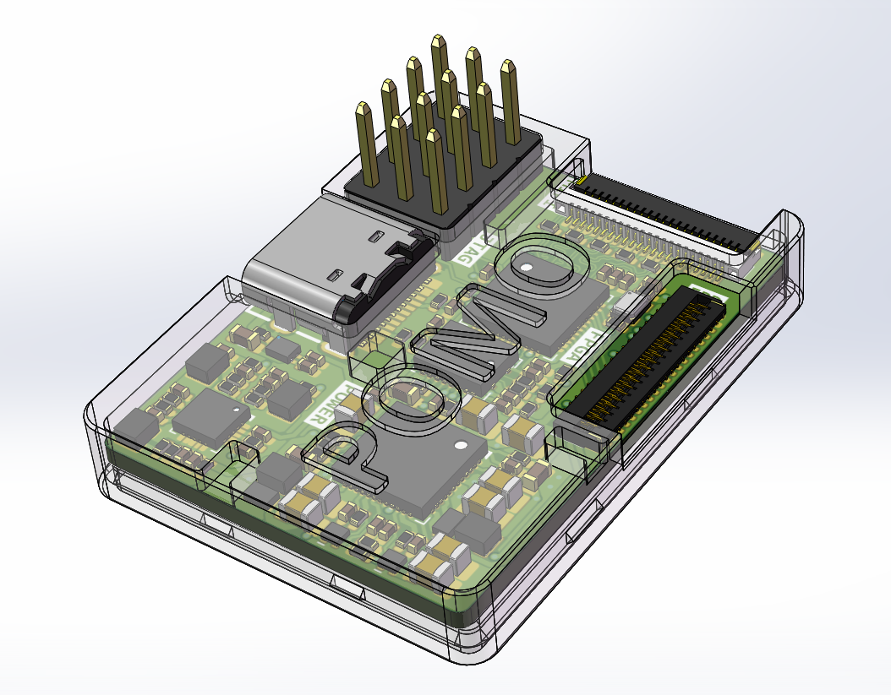
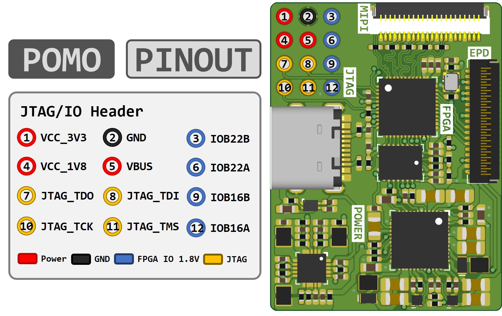
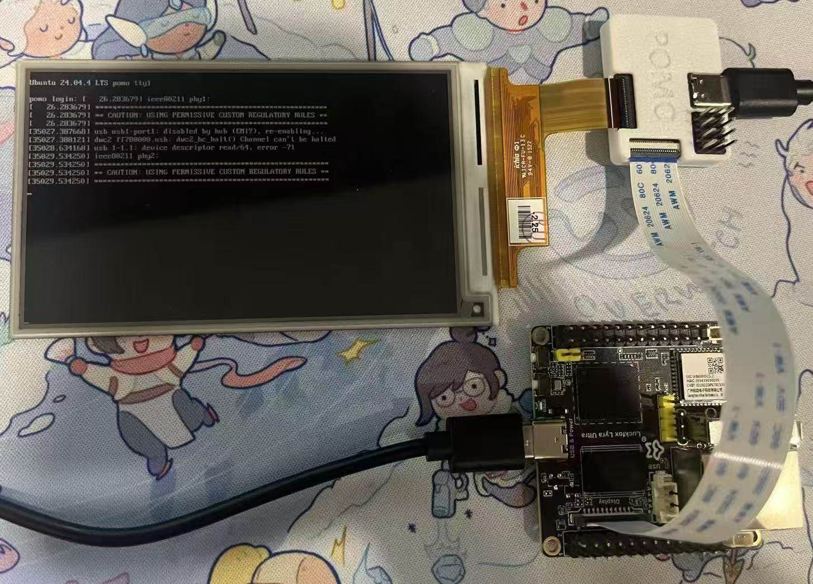

# Pomo

FPGA-based EPD (e-ink display) driver board.

<div align="center">
  
</div>

## Overview

Pomo is an open-source hardware project that drives E-Ink panels via MIPI DSI input. It uses a Gowin GW1NSR-4C FPGA and HyperRAM framebuffer. The MIPI input has been tested with **Luckfox** and **Waveshare** development boards, connected via a reverse FPC cable.

The repository contains two hardware and firmware generations. V1 is the original 8-bit EPD interface. V2 adds a 16-bit EPD source interface, SY7636A/TPS65185 PMIC selection, high-resolution timing support, an internal test-pattern generator, and additional MIPI/framebuffer fault protection. Use matching hardware and firmware versions.

The firmware is based on the [Caster](https://gitlab.com/zephray/Glider) EPDC design by Wenting Zhang, ported to the Gowin platform. The original Caster RTL was written for Xilinx Spartan-6 — key changes include replacing Xilinx IP cores (PLL, BRAM, FIFO) with Gowin equivalents, simplifying the pixel processing pipeline for standalone use without a CSR interface, and adding HyperRAM-based framebuffer support.

## Pinout

<div align="center">
  
</div>

## Example

<div align="center">
  
</div>

## Project Structure

```
Pomo_DriverBoard/
├── Firmware/
│   ├── V1/                    Firmware for the original 8-bit board
│   │   ├── src/               Verilog source
│   │   ├── waveform/          EPD waveform LUT files (.mi)
│   │   ├── scripts/           Waveform conversion tools
│   │   └── Pomo.gprj          Gowin EDA project file
│   └── V2/                    Firmware for the 16-bit board
│       ├── src/               Verilog source
│       ├── waveform/          EPD waveform LUT files (.mi)
│       ├── scripts/           Waveform conversion tools
│       └── Pomo.gprj          Gowin EDA project file
├── Hardware/
│   ├── V1/                    Original 8-bit Altium design
│   └── V2/                    16-bit Altium design and manufacturing files
├── Case/                      Enclosure CAD files (SolidWorks / STEP)
├── Assets/                    Images
└── LICENSE                    CERN-OHL-S v2
```

## Building the Firmware

Open the project matching your board in Gowin EDA V1.9.12:

- V1 hardware: `Firmware/V1/Pomo.gprj`
- V2 hardware: `Firmware/V2/Pomo.gprj`

Run Synthesis → Place & Route → Generate Bitstream. Do not use a V1 bitstream on V2 hardware or a V2 bitstream on V1 hardware because their EPD data width, pin assignment, and PMIC control differ.

### V2 configuration

The main V2 build options are in `Firmware/V2/src/defines.vh`:

| Option | Description |
|--------|-------------|
| `PMIC_SY7636A` | Defined for SY7636A; comment it out to build the TPS65185 path |
| `EPD_OUTPUT_WIDTH` | Selects the 8-bit or 16-bit EPD source output path |
| `EPD_INTERNAL_TEST` | Replaces the MIPI video stream with the internal test-pattern generator |
| `EPD_TEST_PATTERN` | Selects the internal static/dynamic test pattern |

V2 removes FPGA control of PMIC WAKEUP/VCOM and EPD GDOE/SDOE. These signals are handled by the V2 hardware design.

## Adapting for Your Panel

Edit `Firmware/V1/src/defines.vh` or `Firmware/V2/src/defines.vh`, depending on the board version:

| Parameter | Description |
|-----------|-------------|
| `DEFAULT_VFP`, `DEFAULT_VSYNC`, `DEFAULT_VBP`, `DEFAULT_VACT` | Vertical timing |
| `DEFAULT_HFP`, `DEFAULT_HSYNC`, `DEFAULT_HBP`, `DEFAULT_HACT` | Horizontal timing |
| `VCOM_VOL` | VCOM voltage (check panel datasheet) |
| `CLEAR_FRAMES` | Clear sequence frame count on init |
| `LUT_FRAMES` | Number of frames in the waveform LUT |

Select the waveform `.mi` file that matches your panel in the project settings. Panel configuration headers and waveform conversion scripts are stored inside the corresponding V1 or V2 firmware directory.

## Future Work

- Support different MIPI lane counts (currently 2-lane)
- Support additional EPD panels
- Add non-MIPI input interfaces (for example SPI)

## License

Hardware and Firmware are licensed under the **CERN Open Hardware Licence Version 2 - Strongly Reciprocal (CERN-OHL-S v2)**. See [LICENSE](LICENSE).

Portions of the firmware are derived from the Caster project, originally released under CERN-OHL-P v2. See [Firmware/V1/LICENSE-CERN-OHL-P](Firmware/V1/LICENSE-CERN-OHL-P) and [Firmware/V2/LICENSE-CERN-OHL-P](Firmware/V2/LICENSE-CERN-OHL-P).

## Acknowledgments

- [Wenting Zhang](https://gitlab.com/zephray) — Original Caster EPDC design
- [CERN](https://cern.ch/cern-ohl) — CERN Open Hardware Licence
