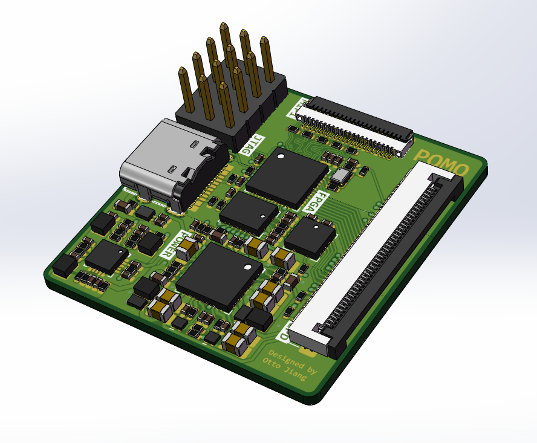
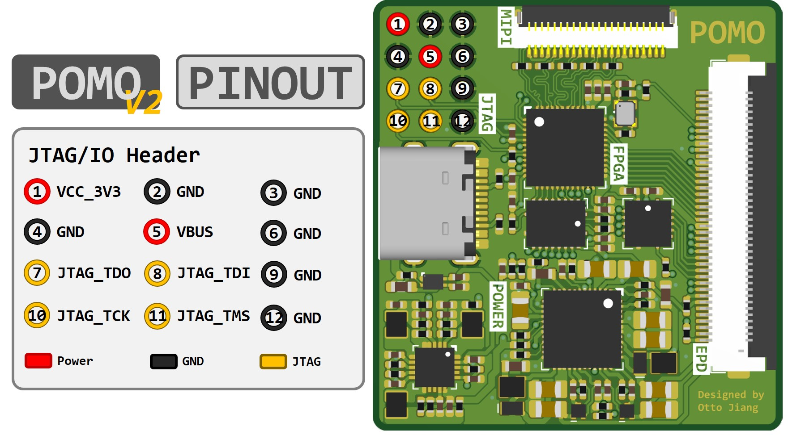
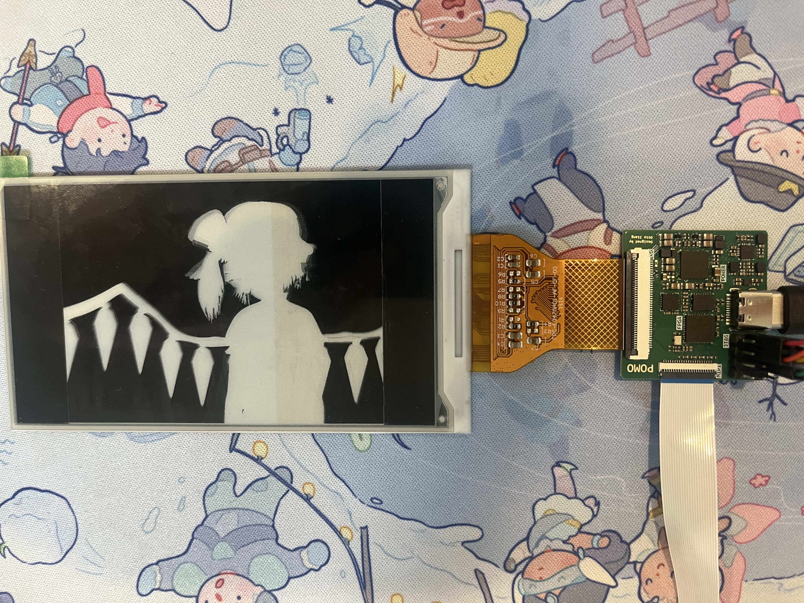

# Pomo DriverBoard V2

[English](README.md) | [简体中文](README_CN.md)

An open-source FPGA controller board that converts a 2-lane MIPI DSI video stream into source/gate timing for raw electrophoretic displays (EPDs).

<div align="center">
  
</div>

## Overview

Pomo V2 is the current hardware and firmware generation. It combines a Gowin GW1NSR-4C FPGA, a HyperRAM framebuffer, an EPD power-management circuit, and a 16-bit parallel source interface on one board. A Linux SBC or other MIPI DSI host supplies ordinary RGB888 video; the FPGA converts it into the waveform-driven pixel states and panel timing required by an E-Ink display.

The design has been tested with Luckfox and Waveshare development boards. The MIPI connector may require a reverse FPC cable depending on the host board.

V1 remains in this repository as the original 8-bit design, but new development targets V2.

## V2 highlights

- 2-lane MIPI DSI RGB888 video input
- Dynamically measured MIPI byte clock and runtime PLL output-divider selection
- HyperRAM framebuffer for current and target pixel states
- 16-bit EPD source bus: eight 2-bit drive pixels are loaded per SDCLK
- Source and gate timing generation for raw EPD panels
- Selectable SY7636A or TPS65185 PMIC control; V2 defaults to SY7636A
- Optional `2W × H` to `W × 2H` pixel reorder for ET073TC1-style panel mappings
- Built-in static and animated test patterns that can replace the MIPI source
- Blue-noise dithering and multiple waveform/update modes
- FIFO, framebuffer and frame-level fault detection with safe EPD output suppression
- Wider horizontal timing counters for high-resolution panels such as 1216 × 684

## Data path

```text
2-lane MIPI DSI
      │
      ▼
Gowin D-PHY RX ──► DSI packet decode ──► RGB888 byte-to-pixel conversion
                                              │
                         optional pixel reorder / internal test source
                                              │
                                              ▼
                               grayscale + dithering + waveform engine
                                              │
                                              ▼
                                      HyperRAM framebuffer
                                              │
                                              ▼
                           16-bit Source timing + Gate timing ──► EPD
```

The firmware is derived from the [Caster EPDC design](https://gitlab.com/zephray/Glider) by Wenting Zhang. The original Spartan-6 implementation was ported to Gowin, adapted to a HyperRAM framebuffer, and extended for MIPI input and standalone panel driving.

## Hardware

V2 exposes a 16-bit EPD data bus together with `SDCLK`, `SDLE`, `SDCE`, `GDCLK`, and `GDSP`. `GDOE` and `SDOE` are handled by pull-ups on the V2 board rather than FPGA pins. PMIC WAKEUP/VCOM control is likewise handled by the V2 hardware, leaving FPGA pins available for `EPD_D8` through `EPD_D15`.

The Altium source, schematic PDF, PCB layout, BOM, and pick-and-place files are in [`Hardware/V2`](Hardware/V2). Do not use V1 firmware on V2 hardware or V2 firmware on V1 hardware: their EPD bus width, pin assignment, and PMIC control differ.

### JTAG / I/O header

<div align="center">
  
</div>

The header provides 3.3 V, VBUS, ground, and the four JTAG signals. Check orientation against the pin-1 marker before connecting a programmer.

## Example

<div align="center">
  
</div>

## Building the V2 firmware

1. Open [`Firmware/V2/Pomo.gprj`](Firmware/V2/Pomo.gprj) in Gowin EDA V1.9.12.
2. Edit [`Firmware/V2/src/defines.vh`](Firmware/V2/src/defines.vh) for the target PMIC, panel timing, source width, waveform mode, and VCOM voltage.
3. Run **Synthesis → Place & Route → Generate Bitstream**.
4. Program the FPGA through the JTAG header.

The checked-in project uses the Gowin-generated MIPI D-PHY and asynchronous FIFO modules. Generated implementation output under `impl/` is intentionally excluded from version control.

## V2 firmware configuration

The main build-time switches are defined in [`Firmware/V2/src/defines.vh`](Firmware/V2/src/defines.vh):

| Option | Purpose |
|---|---|
| `PMIC_SY7636A` | Keep defined for SY7636A; comment it out for TPS65185 |
| `EPD_OUTPUT_WIDTH` | Select the EPD source output width; V2 hardware uses 16 |
| `EPD_INTERNAL_TEST` | Replace the external MIPI stream with the internal video generator |
| `EPD_TEST_PATTERN_MODE` | Select one of the static or animated internal test patterns |
| `EPD_PIXEL_REORDER` | Convert a logical `2W × H` input into a physical `W × 2H` panel raster |
| `DEFAULT_*` | Set the expected MIPI active area, sync and porch timing |
| `DEFAULT_FPS` | Set the expected input frame rate used by the EPD control logic |
| `VCOM_VOL` | Set panel VCOM in millivolts; always verify against the panel datasheet |
| `CLEAR_FRAMES` | Set the final zero-based index of the startup clear sequence |
| `LUT_FRAMES` | Set the waveform LUT length |

The current example configuration is 1216 × 684 at 85 Hz, 16-bit source output, SY7636A, FAST MONO startup mode, and pixel reorder disabled. It is an example for the panel currently under development, not a universal setting.

### Pixel reorder

Some long-strip panels expose a physical raster different from the host-visible video raster. When `EPD_PIXEL_REORDER` is enabled, Pomo applies:

```text
physical(x, 2y)     = logical(2x,     y)
physical(x, 2y + 1) = logical(2x + 1, y)
```

For example, a 750 × 200 MIPI image becomes a 375 × 400 physical EPD image. Reorder mode requires an even input width, an even horizontal total, and a vertical front porch of at least one line. Horizontal padding is applied when the reordered source line does not fill the final output word.

### Internal test source

Define `EPD_INTERNAL_TEST` to test a panel without a running MIPI source. The generated video still passes through the normal reorder, dithering, waveform, framebuffer, and EPD timing pipeline. Available patterns include grayscale steps, bars, checkerboards, and moving regions for checking 16-level grayscale and dynamic update behavior.

### Panel safety

Raw EPD panels require the correct waveform LUT, VCOM setting, supply sequence, and output-enable behavior. A mismatched resolution or malformed input stream can otherwise clock unintended data into areas outside the valid image. V2 detects MIPI FIFO overflow and framebuffer faults and suppresses source/gate activity for the affected frame, but this protection does not replace validation against the panel datasheet.

## Repository layout

```text
Pomo_DriverBoard/
├── Firmware/
│   ├── V2/                    Current 16-bit Gowin firmware
│   └── V1/                    Original 8-bit firmware archive
├── Hardware/
│   ├── V2/                    Current Altium design and manufacturing files
│   └── V1/                    Original hardware archive
├── Case/
│   ├── V2/                    Current enclosure/model assets
│   └── V1/                    Original enclosure/model archive
├── Assets/                    README images
└── LICENSE                    CERN-OHL-S v2
```

## V1 compatibility

V1 is preserved under [`Firmware/V1`](Firmware/V1), [`Hardware/V1`](Hardware/V1), and [`Case/V1`](Case/V1). Open `Firmware/V1/Pomo.gprj` when building for the original 8-bit board. V1 and V2 bitstreams are not interchangeable.

## License

Pomo hardware and firmware are licensed under the **CERN Open Hardware Licence Version 2 – Strongly Reciprocal (CERN-OHL-S v2)**. See [LICENSE](LICENSE).

Portions derived from Caster remain under CERN-OHL-P v2; see [`Firmware/V2/LICENSE-CERN-OHL-P`](Firmware/V2/LICENSE-CERN-OHL-P).

## Acknowledgments

- [Wenting Zhang](https://gitlab.com/zephray) — original Caster EPDC design
- [CERN](https://cern.ch/cern-ohl) — CERN Open Hardware Licence
