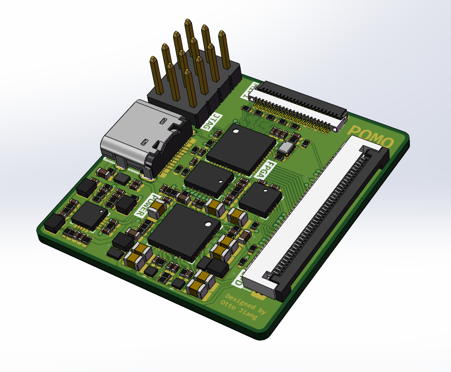
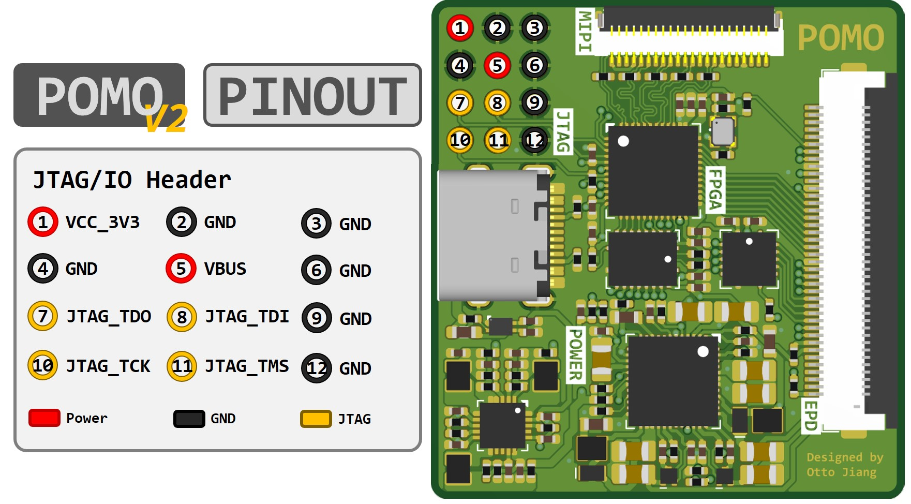
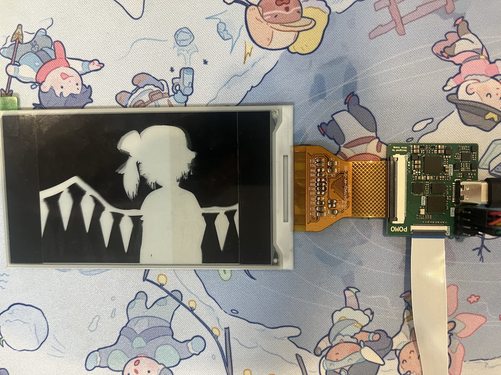
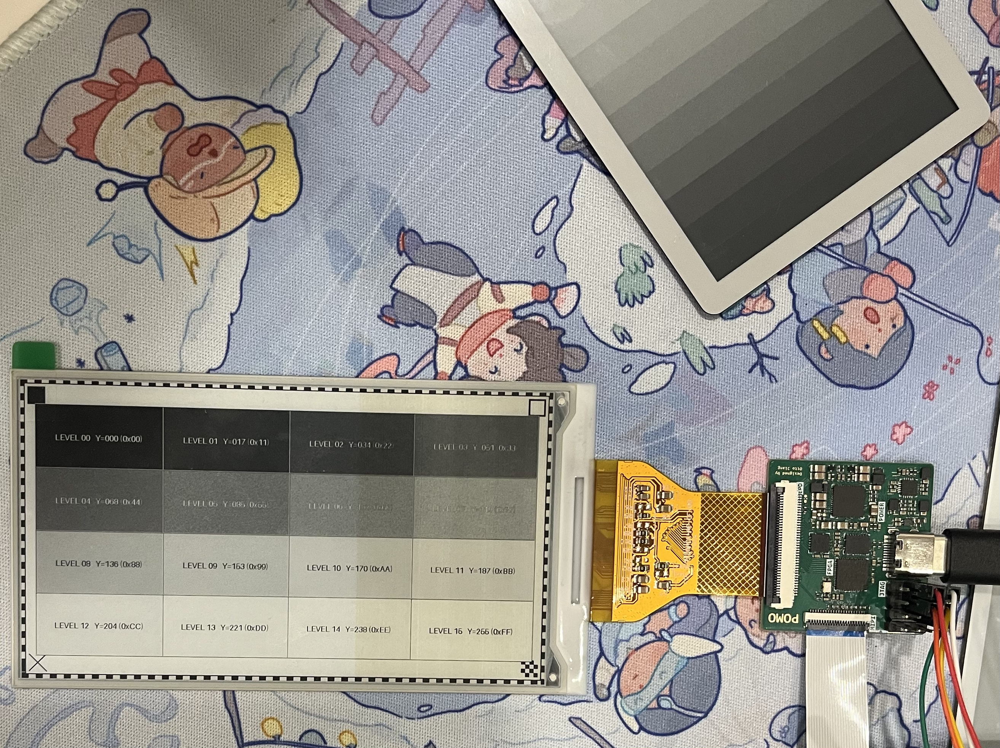

# Pomo

[English](README.md) | [简体中文](README_CN.md)

An open-source FPGA controller board that converts a 2-lane MIPI DSI video stream into source/gate timing for parallel-interface electrophoretic displays (EPDs).

## Overview

Pomo accepts ordinary RGB888 video from a Linux SBC or another MIPI DSI host and converts it into the waveform-driven pixel states and scanning signals required by a parallel-interface E-Ink display. Both generations use a Gowin GW1NSR-4C FPGA and a HyperRAM framebuffer.

## Versions

Pomo currently has two matching hardware and firmware generations:

| | V1 | V2 |
|---|---|---|
| Status | Original version, retained for existing boards | Current version and active development target |
| EPD Source bus | 8-bit, four 2-bit pixels per SDCLK | 16-bit, eight 2-bit pixels per SDCLK |
| PMIC | TPS65185 | SY7636A by default; TPS65185 selectable in firmware |
| Control pins | FPGA controls GDOE, SDOE, PMIC WAKEUP and VCOM control | GDOE/SDOE and PMIC auxiliary control are handled by hardware, freeing pins for D8–D15 |
| Project paths | `Firmware/V1`, `Hardware/V1`, `Case/V1` | `Firmware/V2`, `Hardware/V2`, `Case/V2` |

V1 and V2 bitstreams are not interchangeable because their EPD bus width, pin assignment, and PMIC control differ. Choose one generation and use its matching firmware, hardware, and mechanical files.

## V2

<div align="center">
  
</div>

V2 combines the FPGA, HyperRAM, EPD power-management circuit, and 16-bit parallel Source interface on one board. It is the recommended starting point for new builds and the main focus of the documentation below.

The MIPI input has been tested with Luckfox and Waveshare development boards. Depending on the host connector, a reverse FPC cable may be required.

## V2 highlights

- 2-lane MIPI DSI RGB888 video input
- Gowin MIPI receiver configured for two lanes in 1:16 mode
- Dynamically measured MIPI byte clock and runtime PLL output-divider selection
- HyperRAM framebuffer for current and target pixel states, with optional packed 12-bit state storage
- 16-bit EPD source bus: eight 2-bit drive pixels are loaded per SDCLK
- Source and gate timing generation for parallel-interface EPD panels
- Selectable SY7636A or TPS65185 PMIC control; V2 defaults to SY7636A
- Optional `2W × H` to `W × 2H` pixel reorder for ET073TC1-style panel mappings
- Built-in static and animated test patterns that can replace the MIPI source
- Blue-noise dithering and multiple waveform/update modes
- FIFO, framebuffer and frame-level fault detection with safe EPD output suppression
- Wider horizontal timing counters for high-resolution panels such as 1216 × 684
- Runtime display-mode switching through an in-stream MIPI DSI generic short packet

The current 1216 × 684 configuration has been tested at up to 85 Hz. This result depends on a short, well-routed FPC connection and correctly tuned D-PHY input delay; it is not a guaranteed limit for every host, cable, or PCB.

## Data path

```text
2-lane MIPI DSI
      │
      ▼
Gowin D-PHY RX ──► DSI packet decode ──► RGB888 byte-to-pixel conversion
                                              │
                         optional pixel reorder / internal test source
                                              │
                                              ▼
                               grayscale + dithering + waveform engine
                                              │
                                              ▼
                                      HyperRAM framebuffer
                                              │
                                              ▼
                           16-bit Source timing + Gate timing ──► EPD
```

The firmware is derived from the [Caster EPDC design](https://gitlab.com/zephray/Glider) by Wenting Zhang. The original Spartan-6 implementation was ported to Gowin, adapted to a HyperRAM framebuffer, and extended for MIPI input and standalone panel driving.

## Hardware

V2 exposes a 16-bit EPD data bus together with `SDCLK`, `SDLE`, `SDCE`, `GDCLK`, and `GDSP`. `GDOE` and `SDOE` are handled by pull-ups on the V2 board rather than FPGA pins. PMIC WAKEUP/VCOM control is likewise handled by the V2 hardware, leaving FPGA pins available for `EPD_D8` through `EPD_D15`.

The Altium source, schematic PDF, PCB layout, BOM, and pick-and-place files are in [`Hardware/V2`](Hardware/V2). Do not use V1 firmware on V2 hardware or V2 firmware on V1 hardware: their EPD bus width, pin assignment, and PMIC control differ.

### JTAG / I/O header

<div align="center">
  
</div>

The header provides 3.3 V, VBUS, ground, and the four JTAG signals. Check orientation against the pin-1 marker before connecting a programmer.

## Example

<div align="center">
  
</div>

<div align="center">
  
</div>

## Building the V2 firmware

1. Open [`Firmware/V2/Pomo.gprj`](Firmware/V2/Pomo.gprj) in Gowin EDA V1.9.12.
2. Edit [`Firmware/V2/src/defines.vh`](Firmware/V2/src/defines.vh) for the target PMIC, panel timing, source width, waveform mode, and VCOM voltage.
3. Verify that both generated MIPI IPs use two lanes and the same **1:16** D-PHY mode. The checked-in receiver configuration uses byte/lane alignment and an input delay of 46 on both data lanes; retune this value for the actual board and cable.
4. Run **Synthesis → Place & Route → Generate Bitstream** and confirm that both setup and hold timing pass.
5. Program the FPGA through the JTAG header.

The checked-in project uses Gowin-generated MIPI D-PHY, protocol-decoder, PLL, framebuffer and FIFO modules. The generated IP configuration and source under `Firmware/V2/src` are tracked because regenerating an IP with different GUI settings changes hardware behavior. Disposable synthesis, simulation and implementation products are excluded from version control.

## V2 firmware configuration

The main build-time switches are defined in [`Firmware/V2/src/defines.vh`](Firmware/V2/src/defines.vh):

| Option | Purpose |
|---|---|
| `PMIC_SY7636A` | Keep defined for SY7636A; comment it out for TPS65185 |
| `EPD_OUTPUT_WIDTH` | Select the EPD source output width; V2 hardware uses 16 |
| `EPD_INTERNAL_TEST` | Replace the external MIPI stream with the internal video generator |
| `EPD_TEST_PATTERN_MODE` | Select one of the static or animated internal test patterns |
| `EPD_TEST_PATTERN_FPS` | Set the frame rate of the internal test source |
| `EPD_PIXEL_REORDER` | Convert a logical `2W × H` input into a physical `W × 2H` panel raster |
| `EPD_DEFAULT_MODE` | Select the power-on display mode: `8` MONO, `A` MONO + blue noise, `B` GREY, or `C` AUTO LUT |
| `EPD_STATE_12BIT` | Pack four 12-bit pixel states into three 16-bit VFB samples, reducing framebuffer traffic by 25% compared with one 16-bit state per pixel |
| `DEFAULT_*` | Set the expected MIPI active area, sync and porch timing |
| `EPD_STV_TO_G1_CKV` | Set the panel-specific CKV shift distance from STV sampling through the shift immediately before G1 |
| `VCOM_VOL` | Set panel VCOM in millivolts; always verify against the panel datasheet |
| `CLEAR_FRAMES` | Set the final zero-based index of the startup clear sequence |
| `LUT_FRAMES` | Set the waveform LUT length |

The current example configuration uses a 1216 × 684 MIPI input, 16-bit source output, packed 12-bit framebuffer states, SY7636A, MONO startup mode, and pixel reorder disabled. The internal test source runs at 85 Hz. This is an example for the panel currently under development, not a universal setting.

#### Why `EPD_STATE_12BIT` exists

This option changes only the representation stored through the framebuffer; it does **not** change the RGB888 MIPI input into 12-bit color, reduce the EPD output bus width, or reduce the available display modes or grayscale levels.

The processing pipeline's original 16-bit per-pixel state contains a 4-bit display-mode field plus 12 bits of actual per-pixel state. Because the display mode is global and identical for every pixel, repeatedly storing that upper nibble wastes HyperRAM bandwidth. With `EPD_STATE_12BIT` enabled, Pomo removes the repeated mode nibble, packs four 12-bit states into three samples of the existing 16-bit VFB, and restores the current global mode after reading:

```text
original storage: 4 pixels × 16 bits = 64 bits
packed storage:   4 pixels × 12 bits = 48 bits
```

This reduces both framebuffer write and read traffic from 2 bytes to 1.5 bytes per pixel—a 25% reduction—which provides the memory-bandwidth margin needed for high input refresh rates such as the currently tested 85 Hz mode.

- Leave `EPD_STATE_12BIT` defined for the bandwidth-optimized path.
- Comment it out to use the original one-16-bit-state-per-pixel path for comparison, debugging, or an incompatible raster width.
- The framebuffer-side active width (`EPD_HACT` after optional pixel reorder) must be divisible by four, because packing restarts at every line and each group contains four pixels. The current width of 1216 satisfies this requirement. With `EPD_PIXEL_REORDER`, the resulting physical width—not only `DEFAULT_HACT`—must satisfy it.
- No 24-bit VFB IP is required; the optimization deliberately retains the proven 16-bit VFB configuration.

### MIPI receiver configuration and signal integrity

The two generated MIPI IPs must use matching settings:

- **MIPI RX Advance:** two data lanes, 1:16 D-PHY mode, byte alignment enabled, lane alignment enabled.
- **MIPI DSI/CSI-2 Receiver:** DSI interface, two RX lanes, 1:16 D-PHY mode, I/O insertion disabled.

At high lane rates, a syntactically correct design may still show split frames, snow, or corrupted pixels when the sampling eye is too narrow. Use the shortest practical FPC, keep both lanes well matched, and tune `HS Data0/1 IO Delay Value` using repeatable test images. The current value of 46 is a result for the tested Pomo/RK3506 connection, not a panel parameter. This GW1NSR-4C configuration does not perform automatic IODELAY training, so a different host, PCB, or cable may require a new value.

For the current two-lane RGB888 1:16 path:

```text
pixel clock     = H_TOTAL × V_TOTAL × refresh rate
1:16 word clock = pixel clock × 3 / 4
D-PHY clock     = pixel clock × 6
```

When changing resolution or maximum refresh rate, update the corresponding clock constraints in `Firmware/V2/src/Pomo.sdc` as well as the video timing in `defines.vh`. Do not hide failures by removing the HS, byte, pixel, or HyperRAM constraints.

### Runtime display-mode switching

The display mode can be changed without rebuilding the FPGA by sending a MIPI DSI **Generic Short Write, 2 parameters** packet (`DT = 0x23`):

| Payload | Mode |
|---|---|
| `50 08` | MONO |
| `50 0A` | MONO + blue noise |
| `50 0B` | GREY |
| `50 0C` | AUTO LUT |

Send this packet in HS while the controller remains in video mode. Do **not** switch the DesignWare DSI host's `MODE_CFG` to command mode and back: doing so restarts the video packetizer at an arbitrary horizontal phase and can shift the image. A Linux kernel panel/bridge driver should normally issue the packet through `mipi_dsi_generic_write()`. If a diagnostic register-level tool is used, it must leave `MODE_CFG`, `VID_MODE_CFG`, and the running video timing unchanged and only enqueue the HS short packet through the generic-command FIFO.

### Determining the MIPI scan timing

The `DEFAULT_H*` and `DEFAULT_V*` values describe the video timing received over MIPI DSI. They must match the mode generated by the host exactly; they are not copied from the EPD gate-driver blanking requirements.

1. Open the [Video Timings Calculator](https://tomverbeure.github.io/video_timings_calculator).
2. Enter the logical MIPI image width under **Horizontal Pixels**, the logical image height under **Vertical Pixels**, and the required frame rate under **Refresh Rate (Hz)**. Use progressive scan with margins disabled unless the host has a specific requirement otherwise.
3. In the results table, use the values from the **CVT-RBv2** column. Do not mix values from the CVT, CVT-RB, CEA-861, or DMT columns.
4. Copy the CVT-RBv2 results into `Firmware/V2/src/defines.vh` using this mapping:

| CVT-RBv2 result | Pomo setting | Unit |
|---|---|---|
| H Active | `DEFAULT_HACT` | pixels |
| H Front Porch | `DEFAULT_HFP` | pixels |
| H Sync | `DEFAULT_HSYNC` | pixels |
| H Back Porch | `DEFAULT_HBP` | pixels |
| V Active | `DEFAULT_VACT` | lines |
| V Front Porch | `DEFAULT_VFP` | lines |
| V Sync | `DEFAULT_VSYNC` | lines |
| V Back Porch | `DEFAULT_VBP` | lines |
| Pixel Clock | host display timing | MHz; convert to Hz if required by the host |

5. Configure the Linux MIPI DSI panel/display mode with the same active area, porches, sync widths, and pixel clock. A typical device-tree timing block has the following shape; the containing node and polarity properties depend on the host display driver:

```dts
display-timings {
    native-mode = <&timing0>;

    timing0: timing0 {
        clock-frequency = <PIXEL_CLOCK_HZ>;
        hactive = <H_ACTIVE>;
        hfront-porch = <H_FRONT_PORCH>;
        hsync-len = <H_SYNC>;
        hback-porch = <H_BACK_PORCH>;
        vactive = <V_ACTIVE>;
        vfront-porch = <V_FRONT_PORCH>;
        vsync-len = <V_SYNC>;
        vback-porch = <V_BACK_PORCH>;
    };
};
```

6. Check the copied values before building:

```text
H_TOTAL = DEFAULT_HACT + DEFAULT_HFP + DEFAULT_HSYNC + DEFAULT_HBP
V_TOTAL = DEFAULT_VACT + DEFAULT_VFP + DEFAULT_VSYNC + DEFAULT_VBP
refresh rate = pixel clock / (H_TOTAL × V_TOTAL)
```

The calculated refresh rate should match the requested rate apart from normal rounding. Whenever the resolution or refresh rate changes, generate a new complete CVT-RBv2 mode and update both the host and Pomo; changing only the pixel clock or only one porch can make the reconstructed MIPI scan position disagree with the incoming packets.

`EPD_STV_TO_G1_CKV` is separate from the CVT-RBv2 video timing. It describes the number of panel CKV shifts from sampling STV through the shift immediately before G1 is selected. Obtain it from the panel or gate-driver timing specification and do not derive it from the MIPI `VFP`, `VSYNC`, or `VBP` values.

When `EPD_PIXEL_REORDER` is enabled, enter the logical host-visible MIPI resolution in the calculator and in `DEFAULT_HACT`/`DEFAULT_VACT`. The physical EPD resolution is produced by the reorder logic and must not be used as the calculator input.

### Pixel reorder

Some long-strip panels expose a physical raster different from the host-visible video raster. When `EPD_PIXEL_REORDER` is enabled, Pomo applies:

```text
physical(x, 2y)     = logical(2x,     y)
physical(x, 2y + 1) = logical(2x + 1, y)
```

For example, a 750 × 200 MIPI image becomes a 375 × 400 physical EPD image. Reorder mode requires an even input width, an even horizontal total, and a vertical front porch of at least one line. Horizontal padding is applied when the reordered source line does not fill the final output word.

### Internal test source

Define `EPD_INTERNAL_TEST` to test a panel without a running MIPI source. The generated video still passes through the normal reorder, dithering, waveform, framebuffer, and EPD timing pipeline. Available patterns include grayscale steps, bars, checkerboards, and moving regions for checking 16-level grayscale and dynamic update behavior.

### Panel safety

Parallel-interface EPD panels require the correct waveform LUT, VCOM setting, supply sequence, and output-enable behavior. A mismatched resolution or malformed input stream can otherwise clock unintended data into areas outside the valid image. V2 detects MIPI FIFO overflow and framebuffer faults and suppresses source/gate activity for the affected frame, but this protection does not replace validation against the panel datasheet.

## Repository layout

```text
Pomo_DriverBoard/
├── Firmware/
│   ├── V2/                    Current 16-bit Gowin firmware
│   └── V1/                    Original 8-bit firmware archive
├── Hardware/
│   ├── V2/                    Current Altium design and manufacturing files
│   └── V1/                    Original hardware archive
├── Case/
│   ├── V2/                    Current enclosure/model assets
│   └── V1/                    Original enclosure/model archive
├── Assets/                    README images
└── LICENSE                    CERN-OHL-S v2
```

## V1 compatibility

V1 is preserved under [`Firmware/V1`](Firmware/V1), [`Hardware/V1`](Hardware/V1), and [`Case/V1`](Case/V1). Open `Firmware/V1/Pomo.gprj` when building for the original 8-bit board. V1 and V2 bitstreams are not interchangeable.

## License

Pomo hardware and firmware are licensed under the **CERN Open Hardware Licence Version 2 – Strongly Reciprocal (CERN-OHL-S v2)**. See [LICENSE](LICENSE).

Portions derived from Caster remain under CERN-OHL-P v2; see [`Firmware/V2/LICENSE-CERN-OHL-P`](Firmware/V2/LICENSE-CERN-OHL-P).

## Acknowledgments

- [Wenting Zhang](https://gitlab.com/zephray) — original Caster EPDC design
- [CERN](https://cern.ch/cern-ohl) — CERN Open Hardware Licence
